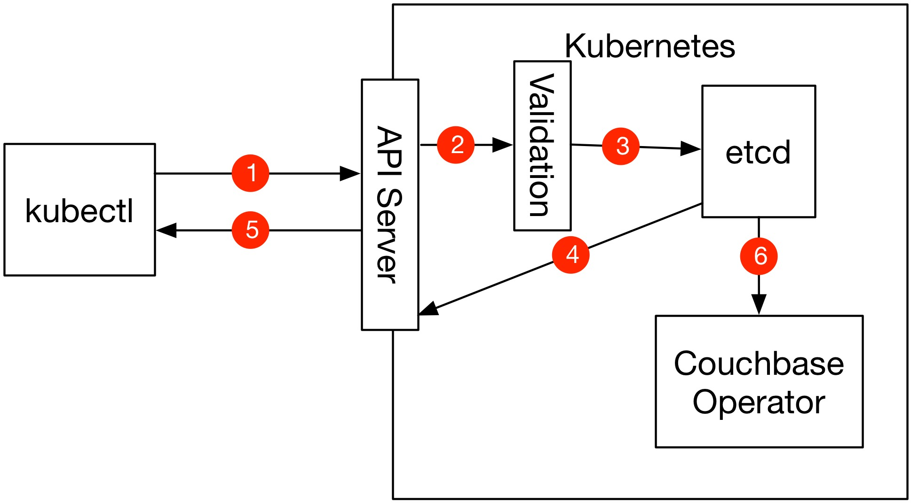

# Ensuring Valid CouchbaseCluster Configurations with cbopctl

The `cbopctl` command implements a subset of the kubectl/oc commands and ensures that CouchbaseCluster objects are valid configurations before they are uploaded to Kubernetes. Checking that a configuration is valid before uploading it is important because once a configuration is uploaded to Kubernetes the Couchbase Operator is unable to handle configuration errors. To better understand why this is the case see the diagram below which shows what happens when a CouchbaseCluster configuration is uploaded to Kubernetes.





1. A kubectl command is run and the CouchbaseCluster configuration is sent to the Kubernetes API Server.
2. The CouchbaseCluster configuration is validated to make sure it is valid.
3. If the CouchbaseCluster configuration is valid it is inserted into etcd. If it is not valid an error is returned to kubectl.
4. etcd acknowleged to the API Server that the CouchbaseCluster object was persisted.
5. A success message is returned to kubectl.
6. The CouchbaseCluster object is sent to the Couchbase operator.

This means that the only place to do validation is in the API Server because errors in the configuration must be caught before the CouchbaseCluster configuration makes it to etcd.

Kubernetes is a constantly evolving project and the ability to validate Custom Resources is still being improved. In Kubernetes 1.8 for example, there is no ability to do validation. In Kubernetes 1.9, there is support for CRD validation, but it isn't complete and doesn't allow for defaulting of configuration parameters. In Kubernetes 1.11 defaulting will be added, but there still won't be support for more complex types of validation. What this means is that in the short term we need to provide a way for users to validate that their configurations are correct before submitting them to Kubernetes and this is why we built the cbopctl tool. cbopctl allows us to add all of our validation code into a command line tool that is run by the user and ensures that invalid configurations can't make it into Kubernetes.

### cbopctl commands

cbopctl implements the create, delete, and apply commands in a similar way as kubectl/oc.

```bash
$ cbopctl
cbopctl [<command>] [<args>]

  apply    Update a Couchbase Cluster
  create   Create a new Couchbase Cluster
  delete   Delete a new Couchbase Cluster

Optional Flags:

     --version                Prints version information
  -h,--help                   Prints the help message


```

The create command should be used to create new CouchbaseClusters, delete can be used to delete CouchbaseClusters (although no validation takes place during a delete so this command is here for completeness), and apply should be used when updating a cluster.

Each subcommand has three flags; one that is required and two that are optional.

```bash
Required Flags:

  -f,--filename               Filename or the resource to create

Optional Flags:

     --dry-run                If true, only print the object that would be sent,
                              without sending it
     --kubeconfig             The path to your kubernetes configuration
  -h,--help                   Prints the help message
```

Specifying a filename to the CouchbaseCluster configuration is required for all commands. The dry run flag can be used to run validation on the configuration file specified without uploading it to Kubernetes. This is particularly useful if you want to use features in kubectl that are not in cbopctl, but you still want to validate the configuration before pushing it to Kubernetes. The kubeconfig flag is also available in case the configuration to your Kubernetes cluster is located on a non-default path.
