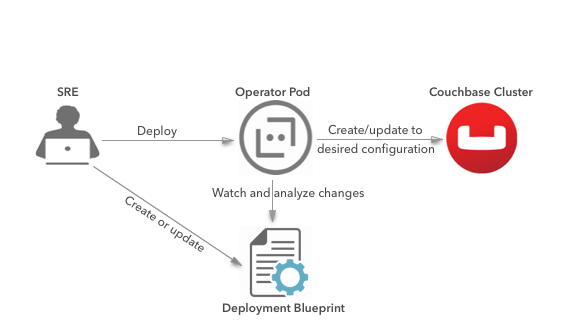

# Running Couchbase on Kubernetes or OpenShift

After deploying a Couchbase cluster using a CRD (deployment blueprint), the Couchbase Operator constantly watches the deployment blueprint for changes and analyzes the differences. Based on the updated information, the Couchbase Operator modifies the Couchbase cluster to reflect the changes in the deployment configuration.

Using a deployment blueprint makes it easy to scale clusters and services up and down. The section on [Scaling a CouchbaseCluster](scalingCouchbase.md) describes how to scale up or scale down a CouchbaseCluster using the deployment blueprint.

A deployment blueprint also helps detect node failures, rebalance out bad nodes, and bring the cluster back to the desired capacity. The section on [Node Recovery](nodeRecovery.md) provides further details.
